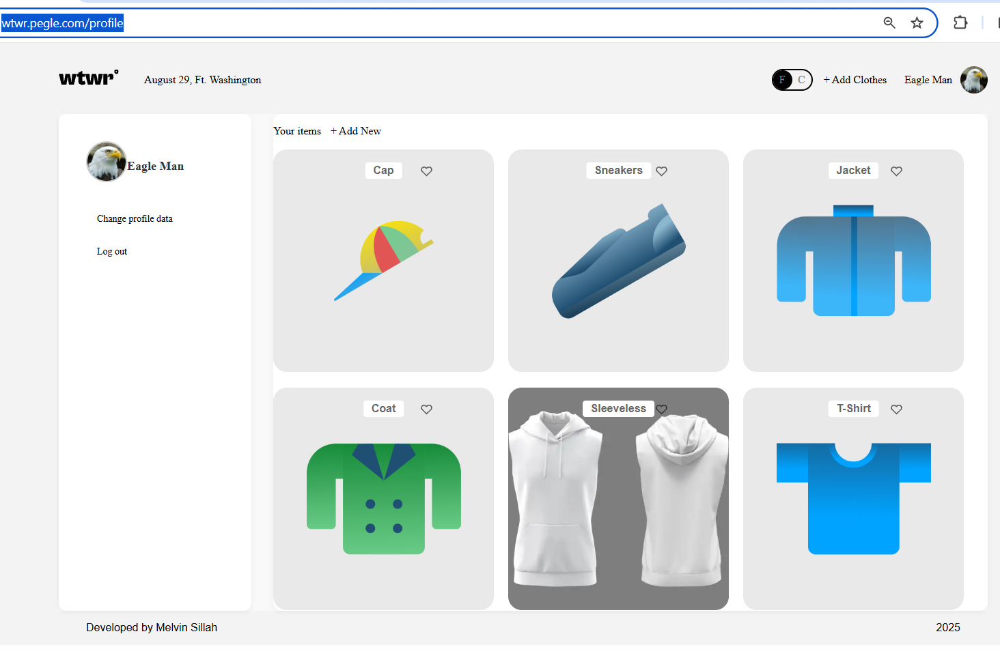

# WTWR (What to Wear?) Frontend

## Project Name

WTWR Frontend – React-based Single Page Application (SPA) for managing clothing items and weather-based outfit suggestions.

## Project Description

The frontend provides an intuitive interface for WTWR users to:

- Register and login securely with JWT authentication
- Update profile information (name, avatar)
- View, add, and like clothing items
- See clothing suggestions based on weather
- Interact seamlessly with the backend API

All frontend requests are configured to respect CORS, and the application uses modern ES6+ syntax for clean, maintainable code.

## Technologies and Techniques Used

- React.js with functional components and hooks for UI
- React Router for client-side routing and SPA navigation
- Context API for managing user state and app-wide data
- Axios / Fetch API for communicating with the backend
- Prettier for consistent code formatting
- ES6+ for modern JavaScript features
- CORS configured via backend API to allow secure cross-origin requests

## Project Structure

se_project_react/
├── public/ # Static assets served publicly
├── src/
│ ├── components/ # Reusable UI components (cards, modals, buttons)
│ ├── contexts/ # Contexts like CurrentUser, temperature unit
│ ├── hooks/ # Custom hooks for fetching and state logic
│ ├── pages/ # Route pages: Login, Profile, Main
│ ├── api/ # API modules to handle backend requests
│ ├── assets/ # Images, icons, screenshots
│ ├── App.jsx # Main App component with routing
│ └── index.js # Entry point
├── package.json # Project metadata and dependencies
├── .eslintrc # Linter configuration (extends airbnb-base)
├── .editorconfig # Editor formatting rules
└── README.md # Project documentation

## Scripts

- npm install - install dependencies
- npm start – launches server on localhost:3001
- npm run build - build for production
- npm run dev – launches server with hot reload on localhost:3001
- npm run lint – runs linter

## Database Setup

- Connection string: mongodb://localhost:27017/wtwr_db

## User Schema

- name – string, 2–30 chars, required
- avatar – URL, required
- email – unique string, required
- password – string, required, select: false

## Clothing Item Schema

- name – string, 2–30 chars, required
- weather – enum: hot, warm, cold
- imageUrl – URL, required
- owner – ObjectId (user reference)
- likes – array of ObjectId (user references)
- createdAt – Date

## API Routes

### Users

- POST /signup – register new user
- POST /signin – log in user
- GET /users/me – get current user
- PATCH /users/me – update profile

### Clothing Items

- GET /items – get all items
- POST /items – add new item
- DELETE /items/:id – delete item (only if owner)
- PUT /items/:id/likes – like item

### Authorization

- Login issues a JWT valid for 7 days
- Middleware verifies JWT and attaches payload to req.user
- Protected routes: all except POST /signup, POST /signin, and GET /items
- Password hashes are never returned

### Error Handling

- 400 – invalid data or CastError
- 401 – authentication errors (invalid token/email/password)
- 403 – forbidden (e.g., deleting another user’s item)
- 404 – user/item not found or non-existent route
- 409 – email already exists
- 500 – internal server error ("An error has occurred on the server.")

### Logging

- Request logs: request.log
- Error logs: error.log
- Logs are excluded from Git

### Deployment

- The backend is deployed to a remote server
- Accessible over both HTTP and HTTPS
- SSL certificate is active and valid
- Frontend communicates with backend API
- Crash-test endpoint: GET /crash-test (server recovers automatically)

## Profile Page Screenshot

## Video Demo

(Add your demo link here)

## Link to the Deployed Server

Deployed Server: https://wtwr.pegle.com, https://www.wtwr.pegle.com
